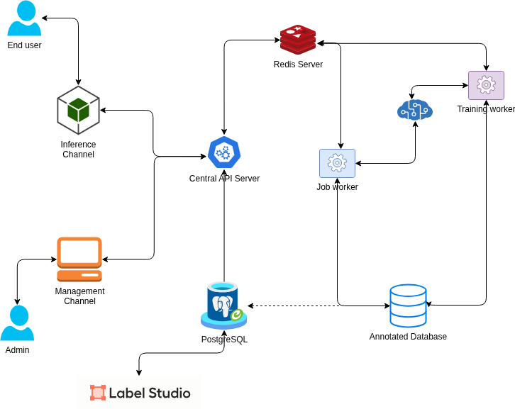

# AI Ecosystem Workspace

## ภาพรวมโปรเจกต์

AI Ecosystem Workspace เป็นระบบ AI ครบวงจร ที่รวมการจัดการ Machine Learning Pipeline ตั้งแต่
การ label ข้อมูล, training model, จนถึง inference สำหรับ end user โดยใช้สถาปัตยกรรมแบบ
**Feature-Driven Modular Architecture**

## สถาปัตยกรรมระบบ (Architecture)



### ส่วนประกอบหลัก

| Component | เทคโนโลยี | หน้าที่ |
|-----------|----------|--------|
| **Central API Server** | FastAPI (Python) | API ตัวกลางเชื่อมต่อทุกส่วนของระบบ |
| **Inference Channel** | FastAPI Router | รับ inference request จาก End user → ประมวลผลผ่าน model |
| **Management Channel** | FastAPI Router | สำหรับ Admin จัดการระบบ, ดู Dashboard, Deploy model |
| **Job Worker** | FastAPI Router + Redis | จัดการ Training Jobs ผ่าน Redis queue |
| **Training Worker** | Background Worker | ดึง job จาก Redis queue → train model |
| **PostgreSQL** | PostgreSQL 15 | ฐานข้อมูลหลัก + Label Studio backend |
| **Redis** | Redis 8.0 | Message queue สำหรับ job dispatching |
| **MinIO** | MinIO | Object storage สำหรับเก็บ model files, datasets |
| **Label Studio** | Label Studio | เครื่องมือ label ข้อมูลสำหรับ training |

## โครงสร้างโปรเจกต์

```
ai-ecosystem-workspace/
├── compose.yml                 # Docker Compose สำหรับ Infrastructure services
├── readme.md                   # ไฟล์นี้
├── diagrams/
│   ├── diagram.drawio          # Architecture diagram (editable)
│   └── diagram.png             # Architecture diagram (image)
├── backend/                    # FastAPI Backend Server
│   ├── main.py                 # Application entry point
│   ├── pyproject.toml          # Python dependencies
│   ├── .env                    # Environment variables
│   ├── core/                   # Shared configuration & utilities
│   ├── db/                     # Database connections
│   ├── api/                    # Feature-Driven API modules
│   │   ├── auth/               # Authentication (login, register, JWT)
│   │   ├── users/              # User CRUD management
│   │   ├── inference/          # Inference Channel
│   │   ├── management/         # Management Channel (Admin)
│   │   └── jobs/               # Job Worker (Training Jobs)
│   └── scripts/                # Utility scripts
```

## การติดตั้งและเริ่มต้นใช้งาน

### 1. เริ่ม Infrastructure Services

```bash
docker compose up -d
```

จะเริ่ม services ต่อไปนี้:
- **PostgreSQL**: `localhost:5433`
- **Redis**: `localhost:6379`
- **MinIO**: API `localhost:9000`, Console `localhost:9001`
- **Label Studio**: `localhost:8080`

### 2. เริ่ม Observability Stack (Assignment 9)

```bash
docker compose -f compose.yml -f compose.observability.yml up -d
```

จะเริ่ม Observability services เพิ่มเติม:
- **OpenTelemetry Collector**: OTLP gRPC `4317`, HTTP `4318`, Prometheus exporter `8889`
- **Prometheus**: `http://localhost:9090` (เก็บ Metrics แบบ time-series)
- **Loki**: `http://localhost:3100` (จัดเก็บ Logs จากทุก Component)
- **Tempo**: `http://localhost:3200` (จัดเก็บ Distributed Tracing)
- **Grafana**: `http://localhost:3000` (Unified Dashboard, user: `admin`, pass: `admin`)

### 3. เริ่ม Backend Server

```bash
cd backend
uv sync
uv run uvicorn main:app --reload
```

### 4. เข้าถึง API Documentation & Observability UIs

- **Swagger UI**: http://localhost:8000/
- **Grafana Dashboard**: http://localhost:3000/
- **Prometheus Targets & Graph**: http://localhost:9090/

## รูปแบบสถาปัตยกรรม: Feature-Driven Modular Architecture

โปรเจกต์นี้เลือกใช้ **Feature-Driven Modular Architecture** ซึ่งจัดกลุ่มโค้ดตาม Feature/Domain
แต่ละ feature จะมี folder ของตัวเองที่รวม router, controller, service, schema ไว้ด้วยกัน

```
feature_name/
├── router.py       # API route definitions
├── controller.py   # Request handling
├── service.py      # Business logic
├── schema.py       # Pydantic models
├── model.py        # SQLAlchemy models (ถ้ามี)
├── repository.py   # Data access layer (ถ้ามี)
└── README.md       # Feature documentation
```

**ข้อดี**: High cohesion, Low coupling, ขยายระบบได้ง่าย, เข้าใจแต่ละ feature ได้ทันที
